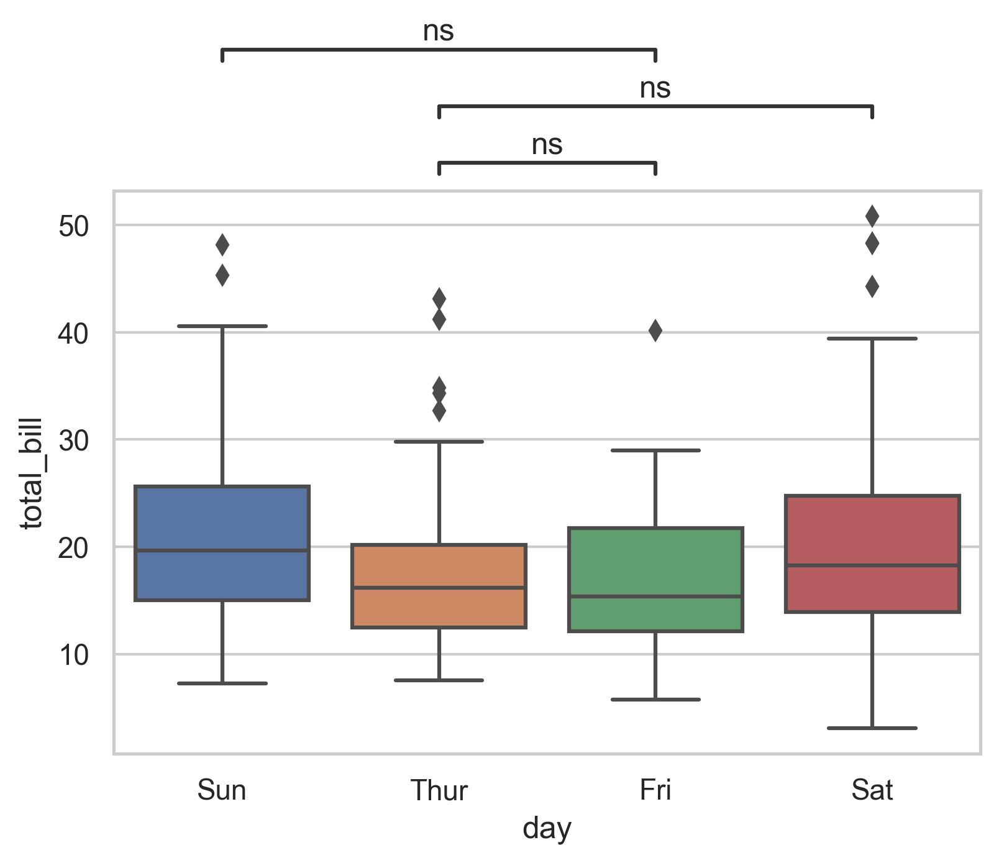
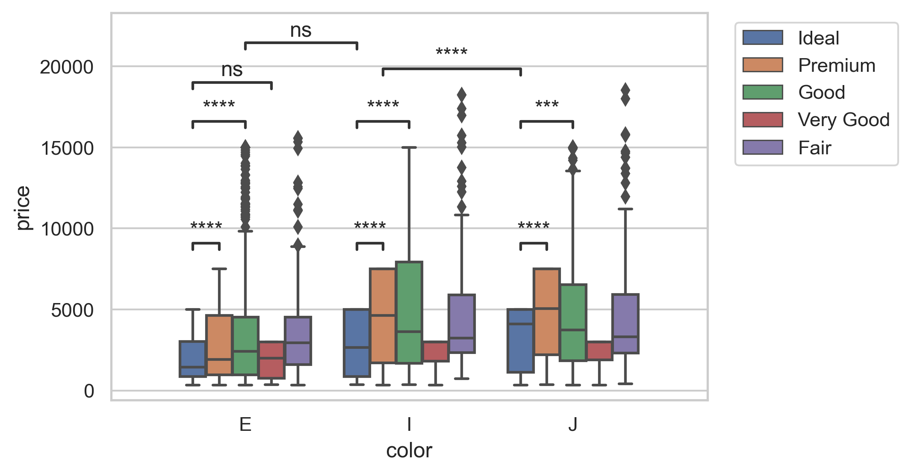

## What is it

Python package to optionnally compute statistical test and add statistical
annotations on an existing boxplot/barplot generated by seaborn.

## Derived work

This is a fork evolving independently from
[webermarcolivier/statannot](https://github.com/webermarcolivier/statannot)
by Marc Weber under an MIT License.  
It is based on commit 1835078 of Feb 21, 2020, tagged "v0.2.3".  

Contrary to statannot, this repository does not publish releases on pypi.org.

The statannot interface, at least until its version 0.2.3, is directly usable in
statannotations, which provides additional features.

## Features

- Single function to add statistical annotations on an existing boxplot/barplot
  generated by seaborn boxplot.
- Integrated statistical tests (binding to `scipy.stats` methods):
    - Mann-Whitney
    - t-test (independent and paired)
    - Welch's t-test
    - Levene test
    - Wilcoxon test
    - Kruskal-Wallis test
- Smart layout of multiple annotations with correct y offsets.
- Annotations can be located inside or outside the plot.
- Corrections for multiple testing can be applied
  (binding to `statsmodels.stats.multitest.multipletests` methods):
    - Bonferroni
    - Holm-Bonferroni
    - Benjamini-Hochberg
    - Benjamini-Yekutieli
    - And any other function from any source with minimal extra code
- Format of the statistical test annotation can be customized:
      star annotation, simplified p-value, or explicit p-value.
- Optionally, custom p-values can be given as input.
      In this case, no statistical test is performed, but corrections for
      multiple testing can be applied.

## Installation

```bash
pip install git+https://github.com/trevismd/statannotations.git
```
or, from the directory into which this repository was cloned:

```bash
pip install -r requirements.txt .
```

## Documentation

See example jupyter notebook [doc/example.ipynb](`doc/example.ipynb).

## Usage

Here is a minimal example:

```python
import seaborn as sns
from statannotations import add_stat_annotation

df = sns.load_dataset("tips")
x = "day"
y = "total_bill"
order = ['Sun', 'Thur', 'Fri', 'Sat']
ax = sns.boxplot(data=df, x=x, y=y, order=order)
test_results = add_stat_annotation(
    ax, data=df, x=x, y=y, order=order,
    box_pairs=[("Thur", "Fri"), ("Thur", "Sat"), ("Fri", "Sun")],
    test='Mann-Whitney', text_format='star', loc='outside', verbose=2)

test_results
```

## Examples





## Requirements

+ Python >= 3.5
+ numpy >= 1.12.1
+ seaborn >= 0.8.1
+ matplotlib >= 2.2.2
+ pandas >= 0.23.0
+ scipy >= 1.1.0
+ statsmodels (optional, for multiple testing corrections)
